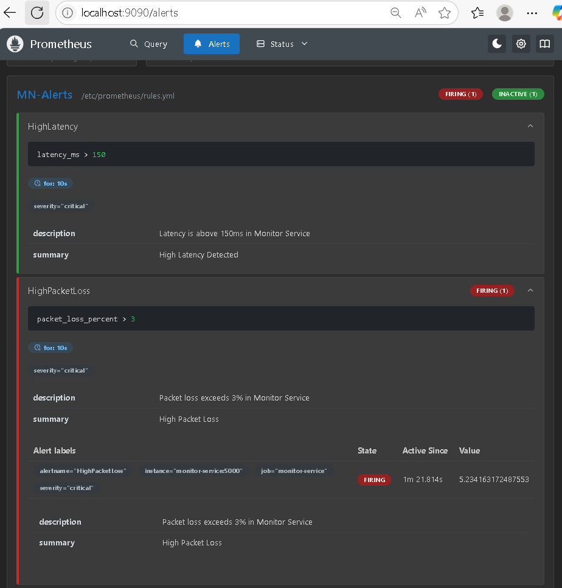

1. **Prometheus Targets:**  
.PNG)

2. **Prometheus Alert:**  


3. **Grafana DataSource:**  
  

4. **Grafana Dashboard:**  
.PNG)

---

# Site-Observability-Platform

> A complete observability solution built with **Prometheus** and **Grafana**, designed to monitor site services, system health, and performance metrics in real-time.

---

## Table of Contents

- [Overview](#overview)  
- [Architecture](#architecture)  
- [Features](#features)  
- [Prerequisites](#prerequisites)  
- [Installation & Setup](#installation--setup)  
- [Usage](#usage)  
- [Configuration & Environment Variables](#configuration--environment-variables)  
- [Project Structure](#project-structure)  
- [Troubleshooting](#troubleshooting)  
- [Contact](#contact)  
- [License](#license)

---

## Overview

**Site-Observability-Platform** provides visibility into infrastructure and site services by combining:

1. **Prometheus** – Collects and stores metrics in a time-series database  
2. **Grafana** – Dashboards and visualization layer  
3. **Alertmanager** – Handles alerts and notifications  
4. **Custom Exporters** – Expose site-specific service metrics  

This platform helps track site uptime, performance, and service reliability with ready-to-use dashboards and alerts.

---

## Architecture

```plaintext
┌─────────────┐   ┌─────────────┐   ┌─────────────┐   ┌─────────────┐   ┌─────────────┐
│   Site 1    │   │   Site 2    │   │   Site 3    │   │   Site 4    │   │   Site 5    │
│  Exporter   │   │  Exporter   │   │  Exporter   │   │  Exporter   │   │  Exporter   │
└──────┬──────┘   └──────┬──────┘   └──────┬──────┘   └──────┬──────┘   └──────┬──────┘
       │                 │                 │                 │                 │
       └─────────────────┴─────────────────┴─────────────────┴─────────────────┘
                                      │
                              ┌───────▼────────┐
                              │                │
                              │   Prometheus   │
                              │ (Collector/DB) │
                              └───────┬────────┘
                        ┌─────────────┴─────────────┐
                        │                           │
            ┌───────────▼───────────┐     ┌─────────▼─────────┐
            │       Grafana          │     │   Alertmanager    │
            │   (Visualization)      │     │     (Alerts)      │
            └────────────────────────┘     └───────────────────┘
```
All services run in containers managed by Docker Compose for easy deployment.

---
## Feature

Ensure the following are installed on your system:
  - Real-time monitoring of site services
  - Pre-configured Grafana dashboards for service visibility
  - Custom alerts for critical thresholds
  - Containerized setup for easy deployment

---

## Prerequisites

Ensure the following are installed on your system:

1. **Docker** – 24.x or later
2. **Docker Compose** – v2.x (included with recent Docker Desktop)

Verify:

```plaintext
docker --version
docker compose version
```

---

## Installation & Setup

1. **Clone the repository**:
```plaintext
git clone https://github.com/AhmedDev374/Site-Observability-Platform.git
cd Site-Observability-Platform
```

2. **Build and start the stack:**:
```plaintext
docker compose up --build
```
Then open .env and set your environment variables (DB credentials, ports, etc.).

3. **Access the services:**:

  - **Grafana** UI: ```http://localhost:3000```
  - **Prometheus**: ```http://localhost:9090```
  - **Alertmanager**: ```http://localhost:9093```
  - **Site 1 Metrics**": ```http://localhost:5001/metrics```
  - **Site 2 Metrics**": ```http://localhost:5002/metrics```
  - **Site 3 Metrics**": ```http://localhost:5003/metrics```
  - **Site 4 Metrics**": ```http://localhost:5004/metrics```
  - **Site 5 Metrics**": ```http://localhost:5005/metrics```
  - **Make A report of all Site**: ```http://localhost:5006/report/30```
      > Will Create A CSV file in: ```/export/report```
---

## Usage
**Monitoring Network Performance**

1. Access the Grafana dashboard at http://localhost:3000
2. Open the "Site Monitoring" dashboard
3. View metrics like uptime, latency, and service status

**Configuring Alerts**

1. Modify alert rules in ```prometheus/alert.rules.yml```
2. Configure notification channels in ```alertmanager/alertmanager.yml```
3. Reload Prometheus configuration after changes:

```plaintext
docker compose exec prometheus kill -HUP 1
```

---

## Configuration & Environment Variables

Create a ```.env``` file to customize the deployment:

```plaintext
# Grafana Configuration
GF_SECURITY_ADMIN_USER=admin
GF_SECURITY_ADMIN_PASSWORD=secure_password
GF_USERS_ALLOW_SIGN_UP=false

# Prometheus Configuration
PROMETHEUS_RETENTION=15d
PROMETHEUS_SCRAPE_INTERVAL=15s

# Alertmanager Email
ALERTMANAGER_SMTP_HOST=smtp.gmail.com
ALERTMANAGER_SMTP_PORT=587
ALERTMANAGER_SMTP_FROM=alerts@example.com
```

---

## Project Structure
```plaintext
Site-Observability-Platform/
├── docker-compose.yml          # Main stack definition
├── prometheus/
│   ├── prometheus.yml          # Prometheus config
│   └── alert.rules.yml         # Alerting rules
├── alertmanager/
│   └── alertmanager.yml        # Alertmanager config
├── grafana/
│   ├── provisioning/
│   │   ├── dashboards/         # Grafana dashboards
│   │   └── datasources/        # Data source configs
│   └── config.ini              # Grafana settings
├── exporters/                  # Custom service exporters
└── README.md                   # Documentation
```
---

## Troubleshooting

**Common Issues**
  1. **Port conflicts:** Change exposed ports in ```docker-compose.yml```
  2. **Metrics not showing:** Verify scrape configurations in ```prometheus/prometheus.yml```
  3. **Container issues:** Check logs:

```plaintext
docker compose logs
docker compose logs prometheus
docker compose logs grafana
```
Restart services if needed:
```plaintext
docker compose restart prometheus
docker compose up -d --build
```

---

## Contact

For questions or feedback, reach out to Ahmed at

1. **LinkDin**: https://eg.linkedin.com/in/ahmed-atef-elnadi-8165a51b9

---

## License

This project is licensed under the **GNU General Public License v3.0**.  
See the full license text here: [LICENSE](LICENSE).

